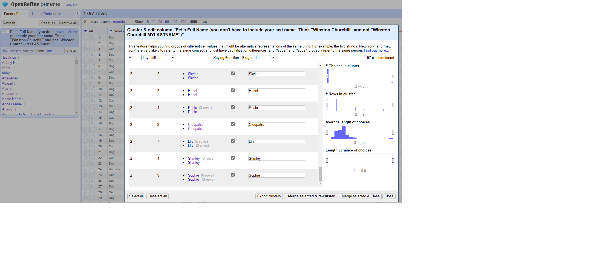
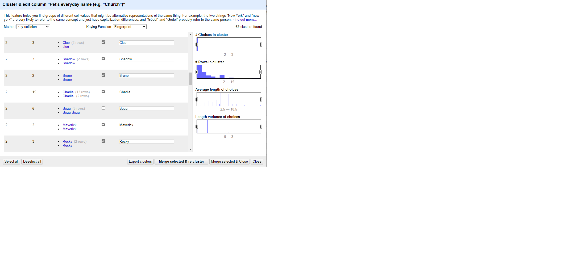
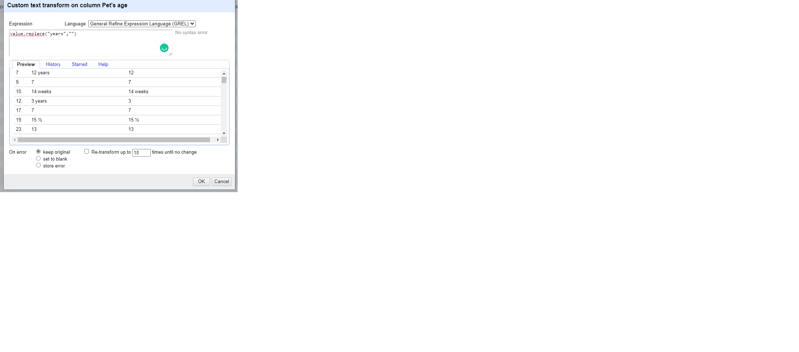
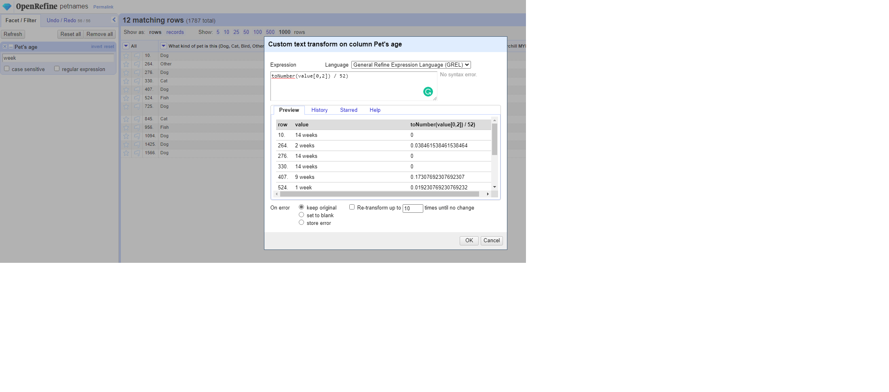

HW 2 - Data Cleaning, CS 625, Fall 2022
================
Brock Briggs
Sep 19, 2022

## Part 1. Data Cleaning

Preparation:

-   Copied Petnames.tsv dataset and pasted into openrefine. Source:
    <https://github.com/jgolbeck/petnames>
-   Parsed cells for text to numbers which identified most of the ‘age’
    column as numbers
-   Initially 1783 records

Steps Taken:

1.  Consolidate the ‘kinds of pets’ to as few as possible

-   Select arrow on column 2 (What kind off pet is this(Dog,…)), create
    text facet, shows 83 choices
-   Selected ‘Cluster’ and merged 15 different clusters of different pet
    types to overcome spelling issues. Resulting values: Dog, Cat,
    Hamster, Guinea pig, Rabbit, Bird, Bunny, Horse, Hermit Crab, Other,
    Chinchilla, Goldfish, Tortoise, Lizard, Fish. Occured under key
    collision method and fingerprinting keying function.
-   Under ‘nearest neighbor’ method levenshtein, consolidated two rows
    of beta fish into one
-   Using key collision and Beider-Morse keying function, merged’Cat’
    and ‘Cats’
-   Experimented with changing radius size and block charts under
    nearest neighbor method ppm. Merged two values of guinea pig, two of
    gold fish, and two of chinchilla.
-   Decided for consolidation purposes to house all types of animals
    under one blanket category. This eliminated beta fish, gold fish,
    other fish to just fish. Same for snakes and geckos.
-   Selected records with one or two rows of animals I didn’t recognize
    and used the ‘Pet’s Breed’ column to identify what animal was being
    spoken a bout. For example pitbull was changed to dog. Torti was
    changed to cat. Often the kind of pet was mispelled or name was
    given in the field incorrectly but by using other information filled
    out can be corrected.
-   Used custom text facet to search for “other” kinds of pets. Used
    expression ’value.replace(“Other:”,““)’ under transform values to
    get rid of the”Other: ” in front of Prairie Dog and Bees.
-   Used value.replace(“Bunny”,“Rabbit”) to merge bunny category with
    rabbit.
-   Trimmed leading and trailing whitespace function under common
    transforms. Also used Titlecase.
-   Saw one record with multiple values in the kind. Used split multi
    valued cells function and then merged with cluster and edit (dog,
    dog, dog, cat).
-   Scrolled through list of 36 and pulled 10 rows of odd named ‘kinds’
    where breed didn’t indicate what kind of animal it was (‘server’,
    ‘virus’, ‘mona’, ‘robot’, etc). Did custom text transform to bring
    these all under ‘Other’.
-   Final Pet kind count of 27.

2.  Pet’s Full Names

-   Merged 57 clusters under key collision fingerprint and 3 under
    ngram-fingerprint 
-   Noted that less name clustering can be done because there’s such a
    variety in spelling names. For example Button and Buttons could
    easily be two distinct names and without knowing more information,
    can’t merge.
-   1461 distinct full names in column with 8 blanks. If I were making
    this dataset complete and had leeway on editing, I would fill the
    full name with the most common name by count for that particular
    animal. This would be done by doing text facet on pet kind,
    selecting the kind of animal it fell into and then doing the same
    for the pet’s full name column to see what is the most common name
    for that category.

3.  Pet’s everyday names

-   Merged 64 clusters under key collision fingerprint and 3 under
    ngram-fingerprint
-   Noted that less name clustering can be done because there’s such a
    variety in spelling names. For example Button and Buttons could
    easily be two distinct names and without knowing more information,
    can’t merge. 

4.  Pet’s Age

-   Merged 15 clusters with key collision and fingerprint. Without any
    way to verify ages, took input as truth so any year with a “?”
    implied that it was correct year. Moved new cell values to suggested
    whole number.
-   Used custom text transform GREL expression ‘value.replace(” years”,
    ““)’ to remove years from all values. Want to get every field to a
    numeric value. This actually changed everything in the column to a
    text value rather than numeric. Will come back and fix this.
    
-   Searched for all values with text filter for everything that
    included deceased and merged into just deceased.
-   Identified multiple categories of numbers, whole and then values in
    months and weeks as well. Need to convert those to one consistent
    value. Given most values are already in years, going to convert
    weeks and months to years. Did text search for ‘week’, whittled
    weeks out using replace function, changed to number with toNumber,
    and divided by 52 weeks to get part of year number. Expression:
    ’toNumber(value.replace(“weeks”,““) / 52)’. Changed one value that
    contained a long sentence manually. Performed similar process for
    months except using 12 as the number divided by.
    ’toNumber(value.replace(”months”,““)) / 12’. Performed the same
    process for”mo” and “mos” signifying months. 
    
-   Edited 4 rows with different verbiage of passing away clustering
    doesn’t pick up on.
-   Text filter searching for “ish” denoting an approximate age. Lots of
    extra characters written in. Going to assume the “ish” value is
    correct. Using ‘value.replace(/\[a-z?()\]/, ““)’ to remove any
    characters to replace any letters, paratheses, or question marks and
    replace with nothing. Same function to remove \~, \<, +.
-   Using custom text transforms for individual rows. “3 months (puppy
    puppy!!!!)” requires not only removal of letters, but a calculation
    to fraction of a year. Entries are unique enough and such a wide
    variety it’s difficult to perform transforms on large quantities.
-   One age had no value at all and just a question mark. Manually
    filled with value of 7 which was about median age for a horse.
-   12 Rows were denoted using 1/2. Used value.replace to remove the
    1/2, replace it with nothing, convert to an umber, and add 0.5.
    Which got rid of all except for the ones that also had ‘months’. Did
    those separately. 
-   When searching “y” and “years” under year, found another row with 4
    listings. Wrote values down because I can separate the values by
    comma in the name but it won’t take the name, age, and breed with
    it. Used split multi valued cells and manually corrected the blank
    values. (buttercup maplesde butternut 2.5 unknown)(zuez maplesden
    zuzy 2.5 unknown)(bella maplesden bella 2 bali dog mix)(hercules
    maplesden hercules 2 tabby cat).
-   Changed different variations of deceased to “Deceased”.
-   Removed word “old” from age rows.
-   Searched for “mo” in pet age, used text facet and included all sub 1
    year old animals. Replaced verbiage with nothing, divided by 12.
    Manually edited two rows.
-   Did same process for a year + months. This gave just the number and
    the months next to each other (for example 5 years and 1 month
    became 51). Wrote down 3 values that couldn’t be combined in the
    same expression 110, 61, 79. Found out slicing values and performing
    a function like division in the same expression doesn’t work.
    Manually changed values.
-   Found another multiple item row. (Bella Nina, Bella, 7, German
    Shepherd)(Thomas JAmes, Tom, 4, Border Collie)(Archie, Archie, 4/12,
    German Shepherd).
-   Did three or for more one off transforms for typed in years.
-   Transformed all to number.

5.  Pet’s Breed

-   Did cluster and merge on 125 clusters with key collision/fingerprint
    . This function works extremely well when variations of spellings is
    high. 15 clusters on ngram-fingerprint with ngram size 3. 38 with
    Ngram size 1. 4 clusters on cologne-phonetic - more selective with
    this one due to wide variation in results.
-   Given the fact of such a wide dispersion in breeds, chose not to get
    too granular on consolidation past obvious mispellings. This was an
    effort to make sure there was representation across the category
    which is how animals are - many people don’t know, they represent an
    extremely diverse mix, or it’s just a normal breed with one slight
    thing different.
-   Performed titlecase transform and changed to text.
-   Used text facet to select all blank fields and changed to “Unknown”.
    All animals have a breed whether or not its known.
-   Performed trim leading and trailing whitespace on this column and
    all other columns.

## Part 2. Analyze Cleaned Data

1.  How many types (kinds) of pets are there?

-   27. After cleaning data cleaning and consolidating, used text facet
        which rendered 27 choices in the left hand column.

2.  How many dogs?

-   1130 dogs. This was found by using that same text facet to sort by
    count instead of name leaving dogs at the top.

3.  How many breeds of dogs?

-   404 breeds. Using the prior text facet listing kinds of pets, I
    selected ‘Dog’ which shows only the dogs in the list. From there I
    used a text facet on Pet’s Breed column where it displays 404
    choices.

4.  What’s the most popular dog breed?

-   Golden Retreiver. Using same count function as before, sorted by
    count leaving Golden Retriever at the top.

5.  What’s the age range of the dogs?

-   6 weeks to 19 years. There are some outlier numbers that got missed
    in cleaning, but clearly aren’t accurate numbers. Used text facet on
    age (even though they’re in numeric), which automatically sorts by
    number. Because of those few outliers that got missed, the numeric
    facet doesn’t work because the slider function essentially goes from
    0 to the outlier number, making it difficult to drill down into the
    first small increment.

6.  What’s the age range of the guinea pigs?

-   1 year to 5 years. Text facet on name to select guinea pigs. There
    were only 13 records so it was easy to identify the range and didnt’
    require any additional sorting

7.  What is the oldest pet?

-   24, Mr Bruce Springsteen the cat. This is the oldest conceivable age
    ignoring any major outliers missed. Selected text facet on pet age
    again and scrolled through the list to verify the range. .

8.  Which are more popular, betta fish or goldfish? How many of each?

-   Betta with a count of 12 over 5 Goldfish based on my data. I
    actually made a mistake cleaning the data by going too heavy on
    consolidating in the pet kinds right at the beginning. I saw there
    was a question about bettas but didn’t anticipate how messy the data
    actually was - I’m guessing there were more bettas and more goldfish
    but me merging fish in the pet kinds first column likely altered my
    number. After going through this problem set, if I were to do it
    again would likely keep the kind category broad at first and then
    compare that to the breed and see if anything could be moved from
    the pet kind to the breed column to eliminate any ‘lost data’. I
    think this is my biggest takeaway from this assigment as well - look
    for opportunities to split column data early on in the process in
    order to preserve data. It can always be deleted later if its not
    important, but you don’t want to limit yourself too early.

9.  What’s the most popular everyday name for a cat?

-   Kitty. Used text facets for kinds and name to sort to highest used.
    Takeaway from this question is people need more original names for
    their cats specifically.

10. What’s the most popular full name for a dog?

-   Maggie and Sadie tied with 7 full names. Same process as prior -
    text facet for kind and full name to sort.

References:

1.  Youtube 2 part series on “Data Wranglin’”. This was one of the most
    helpful videos I watched on different types of expressions. Country
    accent helped me learn better I think.

-     https://www.youtube.com/watch?v=coGClGKPgFw&t=720s

-     https://www.youtube.com/watch?v=g37VcUMsyrs&t=417s

2.  Open Refine Documentation

-     https://docs.openrefine.org/manual/grelfunctions
